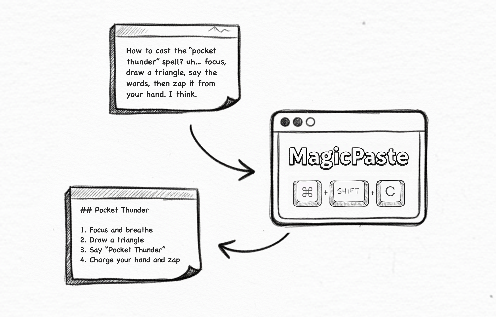

# MagicPaste

MagicPaste is an **intent-aware** clipboard tool. When you paste, it infers the intent from the active window and transforms the content into the **proper format** automatically.

[中文](README_CN.md)｜[Development](DEVELOPMENT.md)｜[License](LICENSE)

### Key Features
- Two-stage generation: stage 1 proposes intent candidates, stage 2 generates final output in parallel
- Context awareness: reads active window info, optional full-screen screenshot
- CLI demo: prints candidates and results in the terminal
- GUI: desktop app connected via a local daemon

### Quick Start
Download the installer and get started: [Download](https://github.com/xfey/MagicPaste/releases)

#### Usage Flow
- Download the correct build for your Mac chip
- Open the dmg installer and drag the app into the Applications folder
- Before first use, click the menu bar icon and add your LLM configuration in Settings
  > We use the OpenAI SDK for model integration. If you want visual features like "image to text", please configure a vision-capable model.

#### Permissions
On first launch, you may see these system prompts. Please allow them:
- Automation: MagicPaste runs a Swift script to read the current app and window title for paste formatting.
- Accessibility: MagicPaste simulates "Command+V" to paste, so it requests Accessibility permission on first use.
- (Optional) Screen recording: if you enable "image to text" or "use screenshots", MagicPaste requests screen recording permission when needed to access images.

**Statement**: MagicPaste does not collect any other information. All related data is used only for clipboard features. The full codebase is open source, and local models are supported for fully offline use.

### Local Development
This repository contains the complete runnable codebase (CLI + native context probing + GUI prototype) for local development and customization. See `DEVELOPMENT.md` for details.

### License
This project is licensed under the Apache License 2.0. See `LICENSE` for details.
