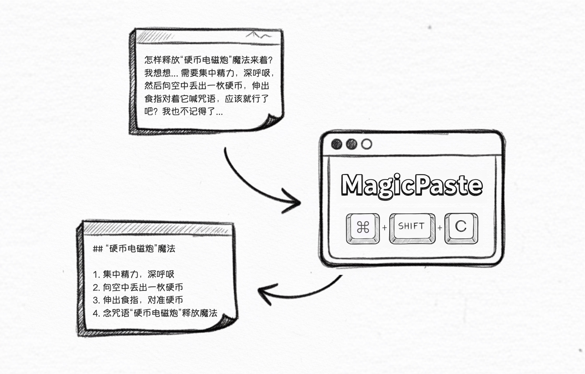

# MagicPaste

MagicPaste 是一款 **意图感知** 剪贴板工具：在粘贴时，它会结合当前窗口推断意图，并自动转换为合适的格式进行粘贴。

[English README](README.md)｜[源代码开发](DEVELOPMENT.md)｜[开源协议](LICENSE)

### 主要功能
- 两阶段生成：阶段一产出意图候选，阶段二并行生成最终内容
- 上下文感知：读取活动窗口信息，可选全屏截图
- CLI Demo：直接在终端输出候选与结果
- GUI：通过本地 daemon 连接桌面端

### 快速上手
点击下载安装包并即刻开始使用：[下载链接](https://github.com/xfey/MagicPaste/releases)

#### 使用流程
- 按照您的 MacBook 芯片类型，选择下载对应的版本
- 打开 dmg 安装包，将应用图标拖动到「应用程序」文件夹，完成安装
- 首次使用前，请点击菜单栏的图标，在设置页面添加大模型配置信息
  > 我们采用 OpenAI SDK 进行大模型接入。如果您希望使用「图片粘贴为文本」等视觉功能，请您设置视觉模型。

#### 权限申请
在首次运行时，可能会遇到如下弹窗，请点击允许：
- 自动化权限：MagicPaste 首次执行时，会通过执行 Swift 脚本来获得当前应用程序、窗口标题信息，以进行粘贴的格式转换。
- 辅助功能：MagicPaste 通过模拟按键“Command+V”来实现粘贴，因此会在首次粘贴时，申请辅助功能权限以模拟键盘按键。
- （可选）屏幕录制：如果您启用了“图片转文本”或“使用屏幕截图”功能，MagicPaste 会在首次调用时申请屏幕截图权限，以获取图像内容。

**声明**：MagicPaste 不会收集除此以外的任何信息，并且所有相关信息都只用于剪贴板功能。MagicPaste 所有代码完全开源，并支持接入本地大模型以支持完全离线使用。

### 本地开发
此仓库包含 MagicPaste 完整可运行的代码（CLI + 原生上下文探测 + GUI 原型），可用于本地开发和代码改造，以满足您的更多要求。开发细节请见 `DEVELOPMENT.md`。

### License
This project is licensed under the Apache License 2.0. See `LICENSE` for details.
